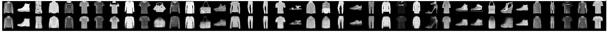
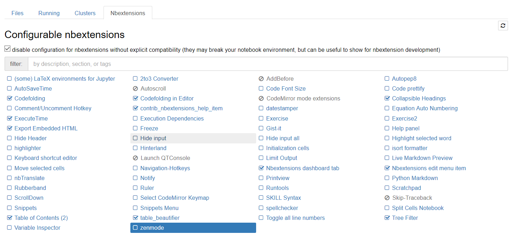

# Intro

This is a test task I did for some reason.
It contains evaluation of:
- FC VAE / FCN VAE on MNIST / FMNIST for image reconstruction;
- Comparison of embeddings produced by VAE / PCA / UMAP for classification;

# TLDR

What you can find here:
- A working VAE example on PyTorch with a lot of flags (both FC and FCN, as well as a number of failed experiments);
- Some experiment boilerplate code;
- Comparison between embeddings produced by PCA / UMAP / VAEs (**spoiler** - VAEs win);
- A step-by step logic of what I did in `main.ipynb`


# Docker environment

To build the docker image from the Dockerfile located in `dockerfile` please do:
```
cd dockerfile
docker build -t vae_docker .
```
(you can replace public ssh key with yours, ofc)

Also please make sure that [nvidia-docker2](https://github.com/nvidia/nvidia-docker/wiki/Installation-(version-2.0)) and proper nvidia drivers are installed.

To test the installation run
```
docker run --runtime=nvidia --rm nvidia/cuda nvidia-smi
```

Then launch the container as follows:
```
docker run --runtime=nvidia -e NVIDIA_VISIBLE_DEVICES=0 -it -v /your/folder/:/home/keras/notebook/your_folder -p 8888:8888 -p 6006:6006 --name vae --shm-size 16G vae_docker
```

Please note that w/o `--shm-size 16G` PyTorch dataloader classes will not work.
The above command will start a container with a Jupyter notebook server available via port `8888`. 
Port `6006` is for tensorboard, if necessary.

Then you can exec into the container like this. All the scripts were run as root, but they must also work under user `keras`
```
docker exec -it --user root REPLACE_WITH_CONTAINER_ID /bin/bash
```
or
```
docker exec -it --user keras REPLACE_WITH_CONTAINER_ID /bin/bash
```

To find out the container ID run
```
 docker container ls
```


# Most important dependencies (if you do not want docker)

These are the most important dependencies (others you can just install in the progress):
```
Ubuntu 16.04
cuda 9.0
cudnn 7
python 3.6
pip
PIL
tensorflow-gpu (for tensorboard)
pandas
numpy
matplotlib
seaborn
tqdm
scikit-learn
pytorch 0.4.0 (cuda90)
torchvision 2.0
datashader
umap
```
If you have trouble with these, look up how I install them in the Dockerfile / jupyter notebook.


# Results

## VAE

**The best model can be trained as follows**

```
python3 train.py \
	--epochs 30 --batch-size 512 --seed 42 \
	--model_type fc_conv --dataset_type fmnist --latent_space_size 10 \
	--do_augs False \
	--lr 1e-3 --m1 40 --m2 50 \
	--optimizer adam \
	--do_running_mean False --img_loss_weight 1.0 --kl_loss_weight 1.0 \
	--image_loss_type bce --ssim_window_size 5 \
	--print-freq 10 \
	--lognumber fmnist_fc_conv_l10_rebalance_no_norm \
	--tensorboard True --tensorboard_images True \
```

If you launch this code, the copy of `FMNIST` dataset will be dowloaded automatically.

Suggested alternative values for the flags for playing with them:
- `dataset_type` - can be set to `mnist` and `fmnist`. In each case will download the necessary dataset
- `latent_space_size` - will affect the latent space in combination with `model_type` `fc_conv` or `fc`. Other model types do not work properly
- `m1` and `m2` control lr decay, but it did not really help here
- `image_loss_type` can be set to `bce`, `mse` or `ssim`. In practice `bce` works best. `mse` is worse. I suppose that proper scaling is required to make it work with `ssim` (it does not train now)
- `tensorboard`  and `tensorboard_images` can also be set to `False`. But they just write logs, so you may just not bother

These flags are optional `--tensorboard True --tensorboard_images True`, in order to use them, you have to 
- install tensorboard (installs with tensorflow)
- launch tensorboard with the following command `tensorboard --logdir='path/to/tb_logs' --port=6006`

You can also resume from the best checkpoint using these flags:
```
python3 train.py \
	--resume weights/fmnist_fc_conv_l10_rebalance_no_norm_best.pth.tar \
	--epochs 60 --batch-size 512 --seed 42 \
	--model_type fc_conv --dataset_type fmnist --latent_space_size 10 \
	--do_augs False \
	--lr 1e-3 --m1 50 --m2 100 \
	--optimizer adam \
	--do_running_mean False --img_loss_weight 1.0 --kl_loss_weight 1.0 \
	--image_loss_type bce --ssim_window_size 5 \
	--print-freq 10 \
	--lognumber fmnist_resume \
	--tensorboard True --tensorboard_images True \
```

The best reconstructions are supposed to look like this (top row - original images, bottow row - reconstructions):


**Brief ablation analysis of the results**

**✓ What worked**
1. Using BCE loss + KLD loss
2. Converting a plain FC model into a conv model in the most straight-forward fashion possible, i.e. replacing this
```
        self.fc1 = nn.Linear(784, 400)
        self.fc21 = nn.Linear(400, latent_space_size)
        self.fc22 = nn.Linear(400, latent_space_size)
        self.fc3 = nn.Linear(latent_space_size, 400)
        self.fc4 = nn.Linear(400, 784)
```        
with this
```
        self.fc1 = nn.Conv2d(1,32, kernel_size=(28,28), stride=1, padding=0)
        self.fc21 = nn.Conv2d(32,latent_space_size, kernel_size=(1,1), stride=1, padding=0)
        self.fc22 = nn.Conv2d(32,latent_space_size, kernel_size=(1,1), stride=1, padding=0)
        
        self.fc3 = nn.ConvTranspose2d(latent_space_size,118, kernel_size=(1,1),  stride=1, padding=0)
        self.fc4 = nn.ConvTranspose2d(118,1, kernel_size=(28,28),  stride=1, padding=0)
```        
3. Using `SSIM` as visualization metric. It correlates awesomely with perceived visual similarity of the image and its reconstruction


**✗ What did not work**
1. Extracting `mean` and `std` from images - removing this feature boosted SSIM on FMNIST 4-5x
2. Doing any simple augmentations (unsurprisingly - it adds a complexity level to a simple task)
3. Any architectures beyond the most obvious ones:
    - UNet inspired architectures (my speculation - this is because image size is very small, and very global features work best, i.e. feature extraction cascade is overkill)
    - I tried various combinations of convolution weights, all of them did not work
    - 1xN convolutions
4. `MSE` loss performed poorly, `SSIM` loss did not work at all
5. LR decay, as well as any LR besides `1e-3` (with adam) does not really help
6. Increasing latent space to `20` or `100` does not really change much

** ¯|_(ツ)_/¯ What I did not try**
1. Ensembling or building meta-architectures
2. Conditional VAEs
3. Increasing network capacity

## PCA vs. UMAP vs. VAE

Please refer to section 5 of the `main.ipynb`

Is notable that:
- VAEs visually worked better than PCA;
- Using the VAE embedding for classification produces higher accuracty (~80% vs. 73%);
- A similar accuracy on train/val can be obtained using [UMAP](https://github.com/lmcinnes/umap);

Jupyter notebook (.ipynb file) is best viewed using these Jupiter notebook extensions (installed with the below command, then to be turned on in the **Jupyter GUI**)

```
pip install git+https://github.com/ipython-contrib/jupyter_contrib_nbextensions
# conda install html5lib==0.9999999
jupyter contrib nbextension install --system
```    
Sometims there is a `html5lib` conflict.
Excluded from the Dockerfile because of this conflict (sometimes occurs, sometimes not).


# Further reading

- (EN) A small intuitive intro (super super cool and intuitive)  https://towardsdatascience.com/intuitively-understanding-variational-autoencoders-1bfe67eb5daf
- (EN) KL divergence explained https://www.countbayesie.com/blog/2017/5/9/kullback-leibler-divergence-explained
- (EN) A more formal write-up http://arxiv.org/abs/1606.05908
- (RU) A cool post series on habr about auto-encoders https://habr.com/post/331382/
- (EN) Converting a FC layer into a conv layer http://cs231n.github.io/convolutional-networks/#convert
- (EN) A VAE post by Fchollet https://blog.keras.io/building-autoencoders-in-keras.html
- (EN) Why VAEs are not used on larger datasets https://www.quora.com/Why-is-there-no-work-of-variational-auto-encoder-on-larger-data-sets-like-CIFAR-or-ImageNet
